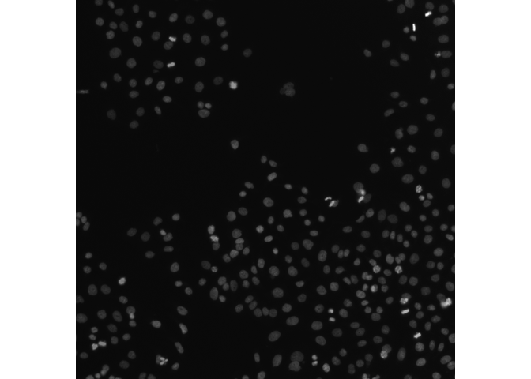

<!-- README.md is generated from README.qmd. Please edit that file -->

# romeo

<!-- badges: start -->

[](https://github.com/Huber-group-EMBL/romeo/actions/workflows/r-universe.yaml)
<!-- badges: end -->

romeo is a minimal R package to reading, writing and validating
multiscale [OME-Zarr](https://ngff.openmicroscopy.org/index.html) (or
OME-NGFF) images.

OME-Zarr is a cloud-friendly data format for storing large bioimaging
datasets, such as microscopy images, that combines **Zarr**, a chunked,
compressed array storage format (<https://zarr.dev/>) designed for
scalable access to multidimensional data, together with **OME-NGFF**
(<https://ngff.openmicroscopy.org/>) metadata standards for describing
multiscale images, segmentations, and coordinate transformations for
bioimaging data formats.

The package also provides helpers and methods to manipulate the
resulting `ome_zarr` objects in the same way one would manipulate
traditional arrays in R. For example, you can subset an `ome_zarr`
object using the `[` operator, and the subsetting will be applied to all
levels of the multiscale OME-Zarr object.

## Installation

You can install the development version of romeo like so:

``` r
# install.packages("pak")
pak::pak("Huber-group-EMBL/romeo")
```

## Reading OME-Zarr images

This example shows how to read an OME-Zarr image of version 0.4. By
default, data are read lazily using `ZarrArray`.

``` r
library(romeo)
library(utils)
omezarrzip <- system.file("extdata", "test_ngff_image_v04.ome.zarr.zip", package = "romeo")
dir.create(td <- tempfile())
unzip(omezarrzip, exdir = td)
x <- ome_read(td)
plot(x, 1)
```



For remote OME-Zarr files, you can use the `paws.storage::s3` client to
read the data directly from the S3 bucket without downloading it first:

``` r
library(paws)
s3_client <- paws.storage::s3(
  config = list(
    credentials = list(anonymous = TRUE),
    region = "auto",
    endpoint = "https://uk1s3.embassy.ebi.ac.uk"
  )
)
x <- ome_read(
  "https://uk1s3.embassy.ebi.ac.uk/idr/zarr/v0.4/idr0076A/10501752.zarr", 
  s3_client = s3_client,
)
```

## Writing OME-Zarr images

romeo also provides utilities for writing OME-Zarr images for OME-NGFF
versions 0.4 and 0.5. The package also supports writing pyramids using
`scalefactors` argument.

``` r
# read image
library(EBImage)
img_file <- system.file("extdata", "example_RGB.png", package="romeo")
img <- readImage(img_file)

# write image pyramid
ome_img <- ome_write(img,
                     path = tempfile(fileext = ".ome.zarr"),
                     version = "0.4",
                     scalefactors = c(2,2,3),
                     storage_options = list(chunk_dim = c(64,64,1)))
plot(ome_img)
#> Only the first frame of the image stack is displayed.
#> To display all frames use 'all = TRUE'.
```


