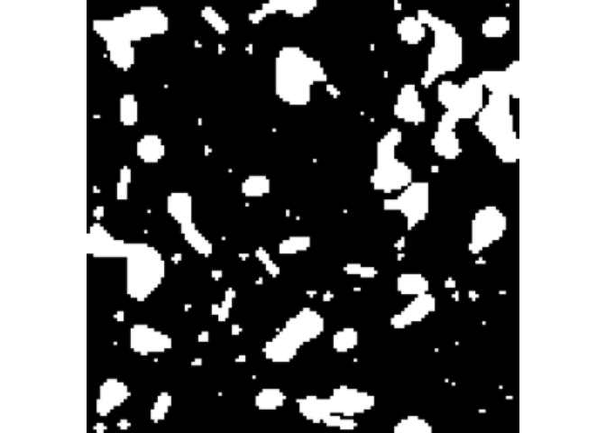

<!-- README.md is generated from README.qmd. Please edit that file -->

# rome

<!-- badges: start -->

[](https://github.com/Huber-group-EMBL/rome/actions/workflows/R-CMD-check.yaml)
<!-- badges: end -->

rome is a minimal R package to read and write multiscale OME-Zarr files.

It also provides helper and methods to manipulate the resulting
`ome_zarr` objects the same way one would manipulate traditional arrays
in R. For example, you can subset an `ome_zarr` object using the `[`
operator, and the subsetting will be applied to all levels of the
multiscale OME-Zarr object.

## Installation

You can install the development version of rome like so:

``` r
# install.packages("pak")
pak::pak("Huber-group-EMBL/rome")
```

## Image

This is a basic example which shows you how to read a OME-ZARR image of
version 0.4. By default, the read will be performed lazily using
`ZarrArray`.

``` r
library(rome)
library(utils)
omezarrzip <- system.file("extdata", "test_ngff_image_v04.ome.zarr.zip", package = "rome")
dir.create(td <- tempfile())
unzip(omezarrzip, exdir = td)
x <- ome_read(td)
x
#> Multiscale OME-Zarr image (v0.4) object.
#> Scale: 1/5 
#> <2 x 5 x 5> DelayedArray object of type "integer":
#> ,,1
#>      [,1] [,2] [,3] [,4] [,5]
#> [1,]   11   16    9   11   11
#> [2,]    9    7   10    6   11
#> 
#> ,,2
#>      [,1] [,2] [,3] [,4] [,5]
#> [1,]    2   11    8   11   10
#> [2,]   12    2    8   11   11
#> 
#> ,,3
#>      [,1] [,2] [,3] [,4] [,5]
#> [1,]   11    6   18    4    7
#> [2,]   12    8   13    6    9
#> 
#> ,,4
#>      [,1] [,2] [,3] [,4] [,5]
#> [1,]   13    8   17    6    3
#> [2,]    9    6    8    5    8
#> 
#> ,,5
#>      [,1] [,2] [,3] [,4] [,5]
#> [1,]   14   13    4   10    5
#> [2,]    9   11    6   12    6
```

Otherwise the read can be performed in memory as:

``` r
x <- ome_read(td, lazy = FALSE)
```

For remote OME-ZARR files, you can use the `paws.storage::s3` client to
read the data directly from the S3 bucket without downloading it first:

``` r
library(paws)
s3_client <- paws.storage::s3(
  config = list(
    credentials = list(anonymous = TRUE),
    region = "auto",
    endpoint = "https://uk1s3.embassy.ebi.ac.uk"
  )
)
x <- ome_read(
  "https://uk1s3.embassy.ebi.ac.uk/idr/zarr/v0.4/idr0076A/10501752.zarr", 
  s3_client = s3_client,
)
plot(x, all = TRUE)
```

## Labels

Labels of image pyramids can also be read as images

``` r
library(rome)
library(utils)
omezarrzip <- system.file("extdata", "test_ngff_image_v04.ome.zarr.zip", package = "rome")
dir.create(td <- tempfile())
unzip(omezarrzip, exdir = td)
x <- ome_read(file.path(td, "labels/blobs"))
plot(x, all = TRUE)
```


