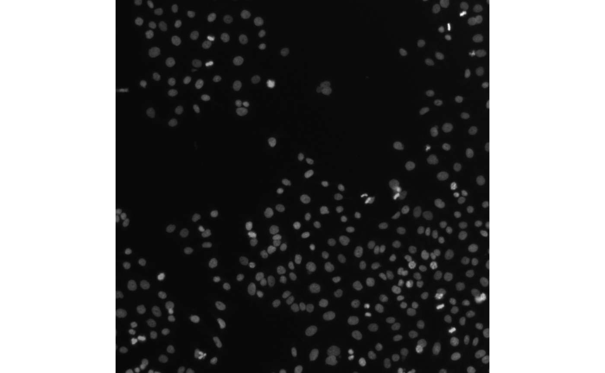
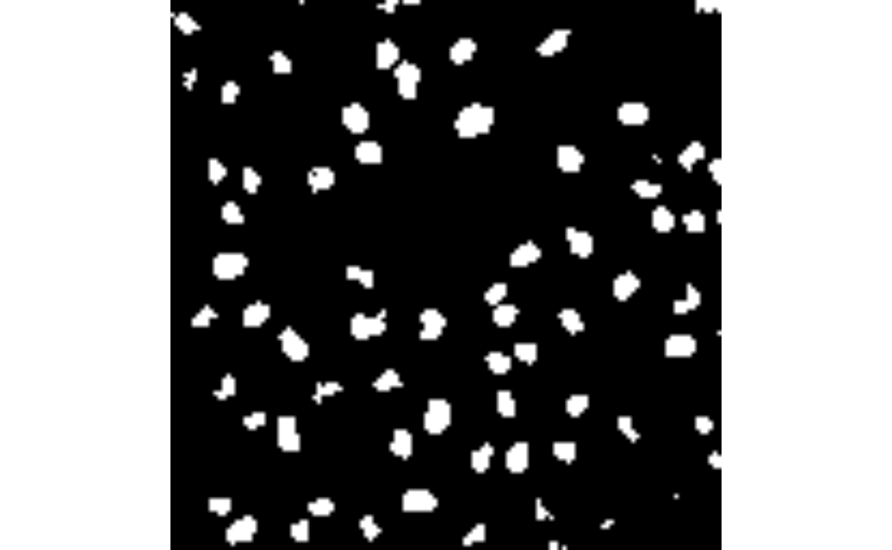
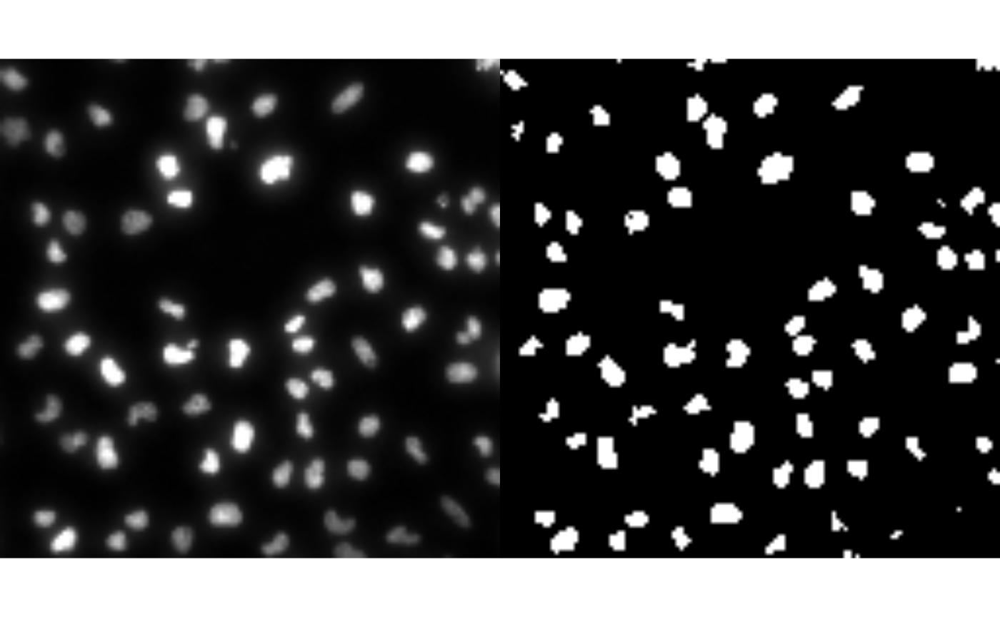

# Introduction to \`rome\`

## Introduction

### OME-ZARR

### rome

*[rome](https://bioconductor.org/packages/3.24/rome)* is a minimal R
package to read and write multiscale OME-ZARR images.

It also provides helper and methods to manipulate the resulting
`ome_zarr` objects the same way one would manipulate traditional arrays
in R. For example, you can subset an `ome_zarr` object using the `[`
operator, and the subsetting will be applied to all levels of the
multiscale OME-Zarr object.

## Installation

You can install the development version of
*[rome](https://bioconductor.org/packages/3.24/rome)* like so:

``` r

# install.packages("pak")
pak::pak("Huber-group-EMBL/rome")
```

## Reading OME-ZARR data

### Images

This is a basic example which shows you how to read a OME-ZARR image of
version 0.4. By default, the read will be performed lazily using
`ZarrArray`.

``` r

library(rome)
library(utils)
omezarrzip <- system.file("extdata", "test_ngff_image_v04.ome.zarr.zip", package = "rome")
dir.create(td <- tempfile())
unzip(omezarrzip, exdir = td)
x <- ome_read(td)
plot(x, 1)
```



Otherwise the read can be performed in memory as:

``` r

x <- ome_read(td, lazy = FALSE)
```

### Labels

Labels of image pyramids can also be read as images

``` r

omezarrzip <- system.file("extdata", "test_ngff_image_v04.ome.zarr.zip", package = "rome")
dir.create(td <- tempfile())
unzip(omezarrzip, exdir = td)
x <- ome_read(file.path(td, "labels/blobs"))
plot(x, all = TRUE)
```


## Reading from S3 storage

For remote OME-ZARR files, you can use the
[`paws.storage::s3`](https://paws-r.r-universe.dev/paws.storage/reference/s3.html)
client to read the data directly from the S3 bucket without downloading
it first:

``` r

library(paws)
s3_client <- paws.storage::s3(
  config = list(
    credentials = list(anonymous = TRUE),
    region = "auto",
    endpoint = "https://uk1s3.embassy.ebi.ac.uk"
  )
)
x <- ome_read(
  "https://uk1s3.embassy.ebi.ac.uk/idr/zarr/v0.4/idr0076A/10501752.zarr",
  s3_client = s3_client,
)
plot(x, all = TRUE)
```

## Writing OME-ZARR data

### Images

*[rome](https://bioconductor.org/packages/3.24/rome)* also provides
utilities for writing OME-ZARR images for OME-NGFF versions 0.4 and 0.5.

``` r

library(EBImage)
img_file <- system.file("extdata", "example_RGB.png", package = "rome")
img <- readImage(img_file)

# write image pyramid
ome_img <- ome_write(img,
                     path = tempfile(fileext = ".ome.zarr"),
                     axes = c("x", "y", "c"),
                     version = "0.4",
                     storage_options = list(chunk_dim = c(64, 64, 1)))
plot(ome_img, 1)
```

    ## Only the first frame of the image stack is displayed.
    ## To display all frames use 'all = TRUE'.


Users can also define there own scaling factors for the image pyramids.
For a `scalefactors` with length three, the pyramid will have four
scales. Eac scale factor in the vector defines the scale factor relative
to the previous scale.

``` r

ome_img <- ome_write(img,
                     path = tempfile(fileext = ".ome.zarr"),
                     axes = c("x", "y", "c"),
                     version = "0.5",
                     scalefactors = c(2, 2, 3),
                     storage_options = list(chunk_dim = c(64, 64, 1)))
```

### Labels

OME-ZARR label pyramids can be generated the same way. We first create
our own label data using EBImage first.

``` r

library(EBImage)

# read the first frame of image
nuc <- readImage(system.file("images", "nuclei.tif", package = "EBImage"))
nuc <- getFrames(nuc)[[1]]

# threshold using otsu's method
nuc_th <- nuc > otsu(nuc)
```

We can now write the label pyramid. Arguments are similar to how images
are written.

``` r

ome_nuc_th <- ome_write(nuc_th,
                        path = tempfile(fileext = ".ome.zarr"),
                        version = "0.4",
                        scalefactors = c(2, 2, 3),
                        storage_options = list(chunk_dim = c(64, 64)),
                        type = "label")
plot(ome_nuc_th, 3)
```



Additional metadata information about labels can be provided using the
`label_metadata` argument.

``` r

# write label, version 0.4
ome_nuc_th <- ome_write(nuc_th,
                        path = tempfile(fileext = ".ome.zarr"),
                        version = "0.4",
                        scalefactors = c(2, 2, 3),
                        storage_options = list(chunk_dim = c(64, 64)),
                        type = "label",
                        label_name = "blobs",
                        label_metadata = list(
                          colors = list(
                            list(`label-value` = 1, rgba = list(255, 255, 255, 255)),
                            list(`label-value` = 2, rgba = list(0, 255, 255, 128))
                          ),
                          properties = list(
                            list(`label-value` = 1, class = "A"),
                            list(`label-value` = 2, class = "B")
                          )
                        ))
```

If the path already includes an image pyramid, then we should define a
name (e.g. `blobs`) for the label pyramid associated with the image.

``` r

td <- tempfile(fileext = ".ome.zarr")

# write image pyramid
ome_nuc <- ome_write(nuc,
                     path = td,
                     version = "0.4",
                     storage_options = list(chunk_dim = c(64, 64)))

ome_nuc_th <- ome_write(nuc_th,
                        path = td,
                        version = "0.4",
                        scalefactors = c(2, 2, 3),
                        storage_options = list(chunk_dim = c(64, 64)),
                        type = "label",
                        label_name = "blobs")
```

    ## An image pyramid was found at '/tmp/RtmpfYBXGj/file1ced31925e16.ome.zarr', writing labels to 'labels/blobs'

``` r

# plot
layout(matrix(1:2, nrow = 1))
plot(ome_nuc, 3)
plot(ome_nuc_th, 3)
```



## Appendix

### Session info

    ## R Under development (unstable) (2026-05-22 r90067)
    ## Platform: x86_64-pc-linux-gnu
    ## Running under: Ubuntu 24.04.4 LTS
    ## 
    ## Matrix products: default
    ## BLAS:   /usr/lib/x86_64-linux-gnu/openblas-pthread/libblas.so.3 
    ## LAPACK: /usr/lib/x86_64-linux-gnu/openblas-pthread/libopenblasp-r0.3.26.so;  LAPACK version 3.12.0
    ## 
    ## locale:
    ##  [1] LC_CTYPE=C.UTF-8       LC_NUMERIC=C           LC_TIME=C.UTF-8       
    ##  [4] LC_COLLATE=C.UTF-8     LC_MONETARY=C.UTF-8    LC_MESSAGES=C.UTF-8   
    ##  [7] LC_PAPER=C.UTF-8       LC_NAME=C              LC_ADDRESS=C          
    ## [10] LC_TELEPHONE=C         LC_MEASUREMENT=C.UTF-8 LC_IDENTIFICATION=C   
    ## 
    ## time zone: UTC
    ## tzcode source: system (glibc)
    ## 
    ## attached base packages:
    ## [1] stats     graphics  grDevices utils     datasets  methods   base     
    ## 
    ## other attached packages:
    ## [1] EBImage_4.55.0   rome_0.99.1      BiocStyle_2.41.0
    ## 
    ## loaded via a namespace (and not attached):
    ##  [1] rappdirs_0.3.4        sass_0.4.10           generics_0.1.4       
    ##  [4] tiff_0.1-12           SparseArray_1.13.2    bitops_1.0-9         
    ##  [7] jpeg_0.1-11           lattice_0.22-9        jsonvalidate_1.5.0   
    ## [10] paws.common_0.8.9     digest_0.6.39         magrittr_2.0.5       
    ## [13] evaluate_1.0.5        grid_4.7.0            bookdown_0.46        
    ## [16] fftwtools_0.9-11      fastmap_1.2.0         Matrix_1.7-5         
    ## [19] R.oo_1.27.1           jsonlite_2.0.0        R.utils_2.13.0       
    ## [22] Rarr_2.1.8            BiocManager_1.30.27   httr2_1.2.2          
    ## [25] textshaping_1.0.5     jquerylib_0.1.4       abind_1.4-8          
    ## [28] cli_3.6.6             rlang_1.2.0           crayon_1.5.3         
    ## [31] XVector_0.53.0        R.methodsS3_1.8.2     ZarrArray_1.1.0      
    ## [34] DelayedArray_0.39.2   cachem_1.1.0          yaml_2.3.12          
    ## [37] S4Arrays_1.13.0       tools_4.7.0           locfit_1.5-9.12      
    ## [40] BiocGenerics_0.59.3   curl_7.1.0            R6_2.6.1             
    ## [43] png_0.1-9             matrixStats_1.5.0     stats4_4.7.0         
    ## [46] lifecycle_1.0.5       V8_8.2.0              S4Vectors_0.51.2     
    ## [49] fs_2.1.0              htmlwidgets_1.6.4     IRanges_2.47.1       
    ## [52] ragg_1.5.2            desc_1.4.3            pkgdown_2.2.0        
    ## [55] bslib_0.11.0          glue_1.8.1            Rcpp_1.1.1-1.1       
    ## [58] systemfonts_1.3.2     xfun_0.57             MatrixGenerics_1.25.0
    ## [61] paws.storage_0.9.0    knitr_1.51            htmltools_0.5.9      
    ## [64] rmarkdown_2.31        compiler_4.7.0        RCurl_1.98-1.18
