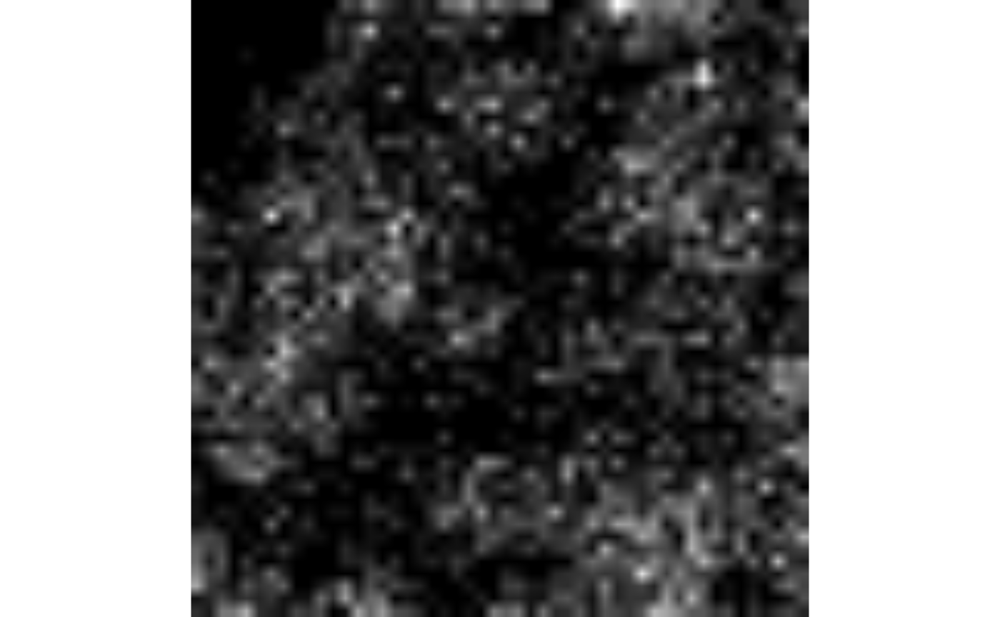

# Introduction to \`romeo\`

## Introduction

### romeo

*[romeo](https://bioconductor.org/packages/3.24/romeo)* is a minimal R
package that provides tools to read, validate, and write multiscale
images and labels (regions, segmentation masks, etc.) stored as
**OME-Zarr** files.

The package uses the
*[Rarr](https://bioconductor.org/packages/3.24/Rarr)* package to
manipulate images stored as Zarr datasets and OME-Zarr metadata while
the *[ZarrArray](https://bioconductor.org/packages/3.24/ZarrArray)*
package is used to lazily read larger-than-memory images.

*[romeo](https://bioconductor.org/packages/3.24/romeo)* realizes these
Zarr-backed images (or labels) as objects of an `ome_zarr` class where a
number of methods are available to manipulate these images as
traditional arrays. These are, for example, subsetting or slicing the
images using the `[` operator which is applied to all levels of the
multiscale OME-Zarr object (i.e. image pyramids).

### What is OME-Zarr?

OME-Zarr is a cloud-friendly data format for storing large bioimaging
datasets, such as microscopy images. It combines:

- **(i)** **Zarr**, a chunked, compressed array storage format
  (<https://zarr.dev/>) designed for scalable access to multidimensional
  data and
- **(ii)** **OME Next-Generation File Formats**, or **OME-NGFF**
  (<https://ngff.openmicroscopy.org/>), that defines standardized
  structures and metadata conventions for multiscale labels,
  segmentations, and coordinate transformations of bioimaging datasets.

In essence, an OME-Zarr file is a collection of data arrays with XYZCT
dimensions (X, Y, and Z for space, C for channels and T for time)
representing an image pyramid, combined with metadata (which lives in
the attributes property of Zarr arrays) that describes the properties of
these arrays, such as scales, annotations and coordinate spaces (Figure
1).

There exists multiple OME-Zarr formats each having its own [OME-NGFF
specifications](https://ngff.openmicroscopy.org/specifications/index.html#)
(Versions 0.3, 0.4, 0.5 etc.) and [Zarr
formats](https://zarr-specs.readthedocs.io/en/latest/specs.html)
(Versions 2 or 3). Currently,
*[romeo](https://bioconductor.org/packages/3.24/romeo)* provides
utilities for manipulating OME-Zarr datasets using NGFF versions 0.4 and
0.5. The current released version of the OME-Zarr specification is 0.5.
See <https://ngff.openmicroscopy.org/specifications> for more
information.


    {
      "multiscales": [
        {
          "version": "0.4",
          "name": "example",
          "axes": [
            {"name": "t", "type": "time", "unit": "millisecond"},
            {"name": "c", "type": "channel"},
            {"name": "z", "type": "space", "unit": "micrometer"},
            {"name": "y", "type": "space", "unit": "micrometer"},
            {"name": "x", "type": "space", "unit": "micrometer"}
          ],
          "datasets": [
            {
              "path": "0",
              "coordinateTransformations": [{
                // the voxel size for the first scale level (0.5 micrometer)
                "type": "scale",
                "scale": [1.0, 1.0, 0.5, 0.5, 0.5]
              }]
            },
            {
              "path": "1",
              "coordinateTransformations": [{
                // the voxel size for the second scale level (downscaled by a factor of 2 on x, y and z dimensions)
                "type": "scale",
                "scale": [1.0, 1.0, 1.0, 1.0, 1.0]
              }]
            },
            {
              "path": "2",
              "coordinateTransformations": [{
                // the voxel size for the third scale level (downscaled by a factor of 4 on x, y and z dimensions)
                "type": "scale",
                "scale": [1.0, 1.0, 2.0, 2.0, 2.0]
              }]
            }
          ],
          "coordinateTransformations": [{
            // the time unit (0.1 milliseconds), which is the same for each scale
            "type": "scale",
            "scale": [0.1, 1.0, 1.0, 1.0, 1.0]
          }],
          ...

## Installation

You can install the development version of
*[romeo](https://bioconductor.org/packages/3.24/romeo)* like so:

``` r

install.packages("pak")
pak::pak("Huber-group-EMBL/romeo")
```

## Reading OME-Zarr files

### Images

This is a basic example which shows you how to read an OME-Zarr image.
By default, data are read lazily using `ZarrArray`. Here, `ome_read`
function first validates if the attributes of the OME-Zarr image comply
with the OME-NGFF specifications (of Version 0.4 in this example), and
if valid, move to reading as a multi-scale `ome_zarr` object.

``` r

library(romeo)
library(utils)
omezarrzip <- system.file("extdata", "test_ngff_image_v04.ome.zarr.zip", package = "romeo")
td <- withr::local_tempfile(fileext = ".ome.zarr")
dir.create(td)
unzip(omezarrzip, exdir = td)

x <- ome_read(td)
plot(x, 1)
```


We can extract each layer of the image pyramid using `[[` method. Each
layer of the image pyramid is a `ZarrArray` object.

``` r

y <- x[[1]]
is(y)
```

    ## [1] "ZarrMatrix"        "ZarrArray"         "DelayedMatrix"    
    ## [4] "DelayedArray"      "DelayedUnaryIsoOp" "DelayedUnaryOp"   
    ## [7] "DelayedOp"         "Array"             "RectangularData"

Alternatively, the data can be read into memory as below using the
`lazy` argument:

``` r

x <- ome_read(td, lazy = FALSE)
y <- x[[1]]
is(y)
```

    ## [1] "matrix"                              "array"                              
    ## [3] "structure"                           "matrix_OR_array_OR_table_OR_numeric"
    ## [5] "vector"                              "vector_OR_factor"                   
    ## [7] "vector_OR_Vector"

### Labels

Labels of an image (or image pyramid) are pixel-level annotations that
are used to annotate regions within the image (pathology annotations,
segmentation masks etc.) where each pixel stores an integer value
corresponding of each label.

Labels of OME-Zarr images are often found nested within the zarr group
of the image, at the same level of the Zarr hierarchy as the resolution
levels for the original image. Each label has its own group under the
`labels` group.

``` r

omezarrzip <- system.file("extdata", "test_ngff_image_v04.ome.zarr.zip", package = "romeo")
td <- withr::local_tempfile(fileext = ".ome.zarr")
dir.create(td)
unzip(omezarrzip, exdir = td)
list.files(td)
```

    ## [1] "labels" "s0"     "s1"     "s2"     "s3"     "s4"

``` r

list.files(file.path(td, "labels"))
```

    ## [1] "blobs"

Once located the path of the label pyramid within the OME-Zarr file, we
can use *[romeo](https://bioconductor.org/packages/3.24/romeo)* again to
read these labels as `ome_zarr` objects.

``` r

x <- ome_read(file.path(td, "labels/blobs"))
plot(x, all = TRUE)
```


## Reading from S3 storage

For remote OME-Zarr files, you can use the
[`paws.storage::s3`](https://paws-r.r-universe.dev/paws.storage/reference/s3.html)
client to read the data directly from the S3 bucket without downloading
it first:

``` r

library(paws)

s3_client <- paws.storage::s3(
  config = list(
    credentials = list(anonymous = TRUE),
    region = "auto",
    endpoint = "https://uk1s3.embassy.ebi.ac.uk"
  )
)
x <- ome_read(
  "https://uk1s3.embassy.ebi.ac.uk/idr/zarr/v0.4/idr0076A/10501752.zarr",
  s3_client = s3_client,
)
```

Slicing (or subsetting) of images are performed using the `[` operator
where indices correspond to each available XYZCT dimensions.

``` r

attr(x, "dim_names")
```

    ## [1] "c" "y" "x"

``` r

plot(x[1:2, 1:50, 1:50])
```

    ## Only the first frame of the image stack is displayed.
    ## To display all frames use 'all = TRUE'.



## Writing OME-Zarr files

### Images

*[romeo](https://bioconductor.org/packages/3.24/romeo)* provides
extensive utilities for writing OME-Zarr images compatible with multiple
[OME-NGFF
specifications](https://ngff.openmicroscopy.org/specifications/index.html#).

Here, `ome_write` function accepts objects of `Image` class (from
*[EBImage](https://bioconductor.org/packages/3.24/EBImage)* package) as
input.

``` r

library(EBImage)
```

    ## 
    ## Attaching package: 'EBImage'

    ## The following object is masked from 'package:paws':
    ## 
    ##     translate

``` r

img_file <- system.file("extdata", "example_RGB.png", package = "romeo")
img <- readImage(img_file)
img
```

    ## Image 
    ##   colorMode    : Color 
    ##   storage.mode : double 
    ##   dim          : 480 320 3 
    ##   frames.total : 3 
    ##   frames.render: 1 
    ## 
    ## imageData(object)[1:5,1:6,1]
    ##           [,1]      [,2]      [,3]      [,4]      [,5]      [,6]
    ## [1,] 0.4196078 0.4196078 0.4235294 0.4235294 0.4235294 0.4235294
    ## [2,] 0.4196078 0.4196078 0.4235294 0.4235294 0.4235294 0.4235294
    ## [3,] 0.4196078 0.4196078 0.4235294 0.4235294 0.4235294 0.4235294
    ## [4,] 0.4196078 0.4196078 0.4235294 0.4235294 0.4235294 0.4235294
    ## [5,] 0.4235294 0.4235294 0.4274510 0.4274510 0.4274510 0.4274510

Currently, *[romeo](https://bioconductor.org/packages/3.24/romeo)*
supports the two most recent OME-NGFF specs, Versions 0.4 and 0.5,
corresponding to Zarr formats v2 and v3, respectively. When writing the
pyramid, we define the version,
e.g. [0.4](https://ngff.openmicroscopy.org/specifications/0.4/index.html),
and also the image axes, e.g. `c("x", "y", "c")`, whose order and length
should match the `Image` object.

``` r

ome_img <- ome_write(img,
                     path = tempfile(fileext = ".ome.zarr"),
                     axes = c("x", "y", "c"),
                     version = "0.4",
                     storage_options = list(chunk_dim = c(64, 64, 1)))
plot(ome_img, 1)
```

    ## Only the first frame of the image stack is displayed.
    ## To display all frames use 'all = TRUE'.


Users can also define their own scaling factors to write image pyramids.
For a `scalefactors` vector with length three, the resulting pyramid
will contain four scales. Each scale factor in the vector defines the
scale factor of the layer relative to the previous layer.

``` r

ome_img <- ome_write(img,
                     path = tempfile(fileext = ".ome.zarr"),
                     axes = c("x", "y", "c"),
                     version = "0.5",
                     scalefactors = c(2, 2, 3),
                     storage_options = list(chunk_dim = c(64, 64, 1)))
```

### Labels

OME-Zarr label pyramids can be generated in the same way. We first
create our own label data using
*[EBImage](https://bioconductor.org/packages/3.24/EBImage)*.

``` r

# read the first frame of the Image object
nuc <- readImage(system.file("images", "nuclei.tif", package = "EBImage"))
nuc <- getFrames(nuc)[[1]]

# threshold using otsu's method
nuc_th <- nuc > otsu(nuc)
nuc_th
```

    ## Image 
    ##   colorMode    : Grayscale 
    ##   storage.mode : logical 
    ##   dim          : 510 510 
    ##   frames.total : 1 
    ##   frames.render: 1 
    ## 
    ## imageData(object)[1:5,1:6]
    ##       [,1]  [,2]  [,3]  [,4]  [,5]  [,6]
    ## [1,] FALSE FALSE FALSE FALSE FALSE FALSE
    ## [2,] FALSE FALSE FALSE FALSE FALSE FALSE
    ## [3,] FALSE FALSE FALSE FALSE FALSE FALSE
    ## [4,] FALSE FALSE FALSE FALSE FALSE FALSE
    ## [5,] FALSE FALSE FALSE FALSE FALSE FALSE

We can now write the label pyramid. The arguments are similar to those
used for writing image pyramids, but when `type = "label"` is specified,
[OME-NGFF label
specifications](https://ngff.openmicroscopy.org/specifications/0.4/index.html#labels-metadata)
is used to write the Zarr attributes.

``` r

ome_nuc_th <- ome_write(nuc_th,
                        path = tempfile(fileext = ".ome.zarr"),
                        version = "0.4",
                        scalefactors = c(2, 2, 3),
                        storage_options = list(chunk_dim = c(64, 64)),
                        type = "label")
plot(ome_nuc_th, 3)
```


If the path already includes an image pyramid, then we should define a
name (e.g. `blobs`) for the label pyramid associated with the image.

``` r

td <- tempfile(fileext = ".ome.zarr")

ome_nuc <- ome_write(nuc,
                     path = td,
                     version = "0.4",
                     storage_options = list(chunk_dim = c(64, 64)))

ome_nuc_th <- ome_write(nuc_th,
                        path = td,
                        version = "0.4",
                        scalefactors = c(2, 2, 3),
                        storage_options = list(chunk_dim = c(64, 64)),
                        type = "label",
                        label_name = "blobs")
```

    ## An image pyramid was found at '/tmp/RtmpDs6wlM/file1bf068d8b34b.ome.zarr', writing labels to 'labels/blobs'

We can now visualize both the image and its corresponding labels side by
side.

``` r

layout(matrix(1:2, nrow = 1))
plot(ome_nuc, 3)
plot(ome_nuc_th, 3)
```


Additional metadata information about labels can also be provided using
the `label_metadata` argument, e.g. colors, properties etc. See
[OME-NGFF image-label
specifications](https://ngff.openmicroscopy.org/specifications/0.4/index.html#image-label-metadata)
for more information.

``` r

ome_nuc_th <- ome_write(nuc_th,
                        path = tempfile(fileext = ".ome.zarr"),
                        version = "0.4",
                        scalefactors = c(2, 2, 3),
                        storage_options = list(chunk_dim = c(64, 64)),
                        type = "label",
                        label_name = "blobs",
                        label_metadata = list(
                          colors = list(
                            list(`label-value` = 1, rgba = list(255, 255, 255, 255)),
                            list(`label-value` = 2, rgba = list(0, 255, 255, 128))
                          ),
                          properties = list(
                            list(`label-value` = 1, class = "A"),
                            list(`label-value` = 2, class = "B")
                          )
                        ))
```

## Appendix

### Session info

    ## R Under development (unstable) (2026-06-12 r90141)
    ## Platform: x86_64-pc-linux-gnu
    ## Running under: Ubuntu 24.04.4 LTS
    ## 
    ## Matrix products: default
    ## BLAS:   /usr/lib/x86_64-linux-gnu/openblas-pthread/libblas.so.3 
    ## LAPACK: /usr/lib/x86_64-linux-gnu/openblas-pthread/libopenblasp-r0.3.26.so;  LAPACK version 3.12.0
    ## 
    ## locale:
    ##  [1] LC_CTYPE=C.UTF-8       LC_NUMERIC=C           LC_TIME=C.UTF-8       
    ##  [4] LC_COLLATE=C.UTF-8     LC_MONETARY=C.UTF-8    LC_MESSAGES=C.UTF-8   
    ##  [7] LC_PAPER=C.UTF-8       LC_NAME=C              LC_ADDRESS=C          
    ## [10] LC_TELEPHONE=C         LC_MEASUREMENT=C.UTF-8 LC_IDENTIFICATION=C   
    ## 
    ## time zone: UTC
    ## tzcode source: system (glibc)
    ## 
    ## attached base packages:
    ## [1] stats     graphics  grDevices utils     datasets  methods   base     
    ## 
    ## other attached packages:
    ## [1] EBImage_4.55.0   paws_0.10.0      romeo_0.99.1     BiocStyle_2.41.0
    ## 
    ## loaded via a namespace (and not attached):
    ##  [1] xfun_0.58             bslib_0.11.0          httr2_1.2.2          
    ##  [4] htmlwidgets_1.6.4     lattice_0.22-9        tools_4.7.0          
    ##  [7] bitops_1.0-9          generics_0.1.4        stats4_4.7.0         
    ## [10] curl_7.1.0            paws.common_0.8.9     R.oo_1.27.1          
    ## [13] Matrix_1.7-5          desc_1.4.3            S4Vectors_0.50.1     
    ## [16] lifecycle_1.0.5       compiler_4.7.0        textshaping_1.0.5    
    ## [19] tiff_0.1-12           htmltools_0.5.9       sass_0.4.10          
    ## [22] RCurl_1.98-1.19       yaml_2.3.12           pkgdown_2.2.0        
    ## [25] crayon_1.5.3          jquerylib_0.1.4       R.utils_2.13.0       
    ## [28] cachem_1.1.0          DelayedArray_0.38.2   jsonvalidate_1.5.0   
    ## [31] abind_1.4-8           locfit_1.5-9.12       digest_0.6.39        
    ## [34] paws.storage_0.10.0   bookdown_0.46         fastmap_1.2.0        
    ## [37] grid_4.7.0            cli_3.6.6             SparseArray_1.13.2   
    ## [40] Rarr_2.0.1            magrittr_2.0.5        S4Arrays_1.13.0      
    ## [43] withr_3.0.2           rappdirs_0.3.4        rmarkdown_2.31       
    ## [46] XVector_0.53.0        matrixStats_1.5.0     fftwtools_0.9-11     
    ## [49] jpeg_0.1-11           otel_0.2.0            ragg_1.5.2           
    ## [52] png_0.1-9             R.methodsS3_1.8.2     evaluate_1.0.5       
    ## [55] knitr_1.51            IRanges_2.46.0        V8_8.2.0             
    ## [58] rlang_1.2.0           Rcpp_1.1.1-1.1        glue_1.8.1           
    ## [61] ZarrArray_1.1.0       BiocManager_1.30.27   xml2_1.5.2           
    ## [64] BiocGenerics_0.58.1   jsonlite_2.0.0        R6_2.6.1             
    ## [67] MatrixGenerics_1.25.0 systemfonts_1.3.2     fs_2.1.0
